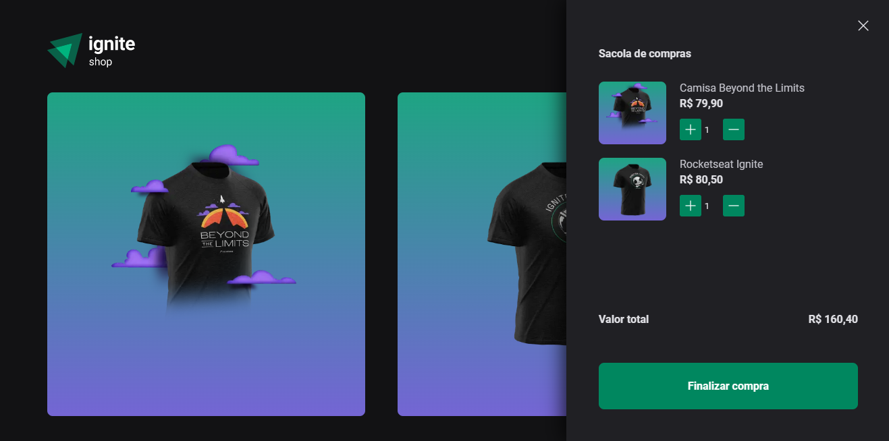

## E-Commerce

  

O Finance é uma aplicação simples de controle financeiro, onde você pode cadastrar suas entradas e saídas, e ver o saldo total.
Além disso, você pode gerenciar suas transações, em categorias, o que facilita a visualização do seu dinheiro.

### 🛠️ Nesse projeto foi utilizado

- NextJS
- Typescript
- React
- Stripe
- Styled Components

 

## 🚧 Layout

## :memo: Licença

Esse projeto está sob a licença MIT. Veja o arquivo [LICENSE](.github/LICENSE) para mais detalhes.

---

Feito com ♥ by JulioAmaral007

&nbsp;